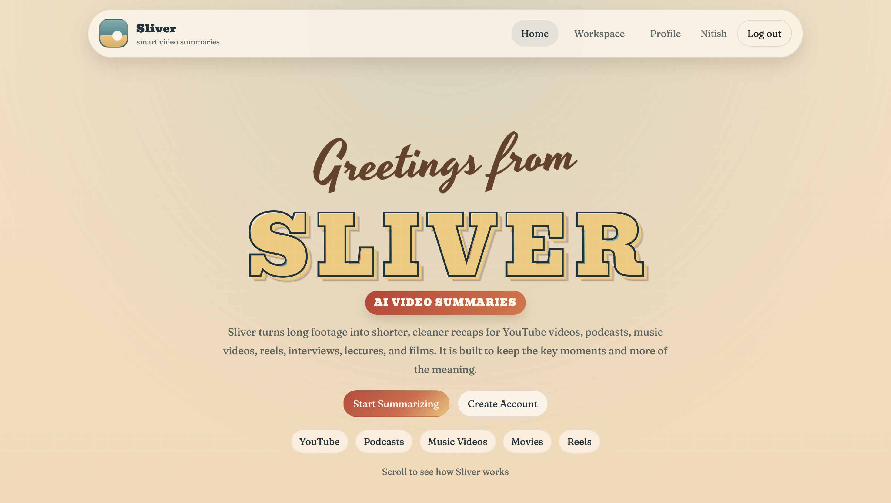
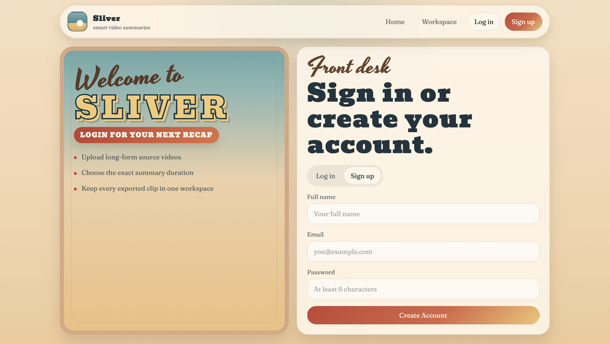
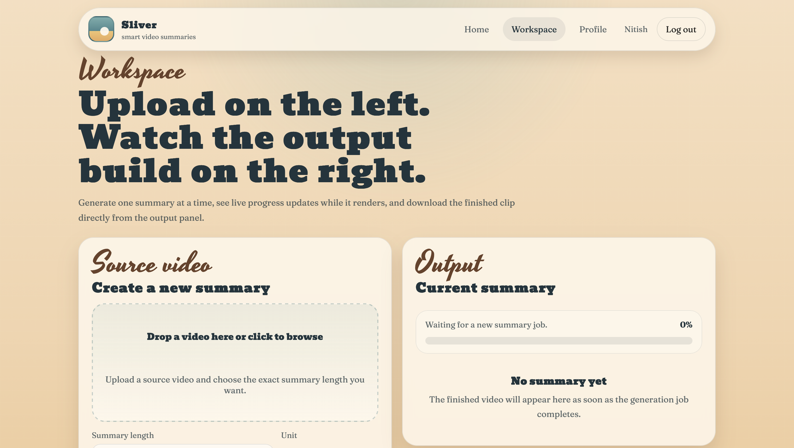
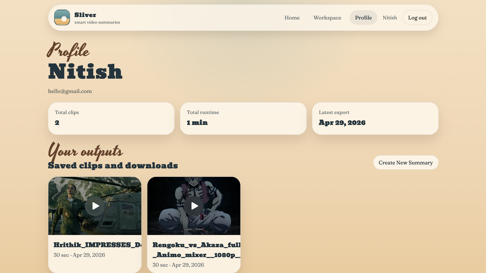
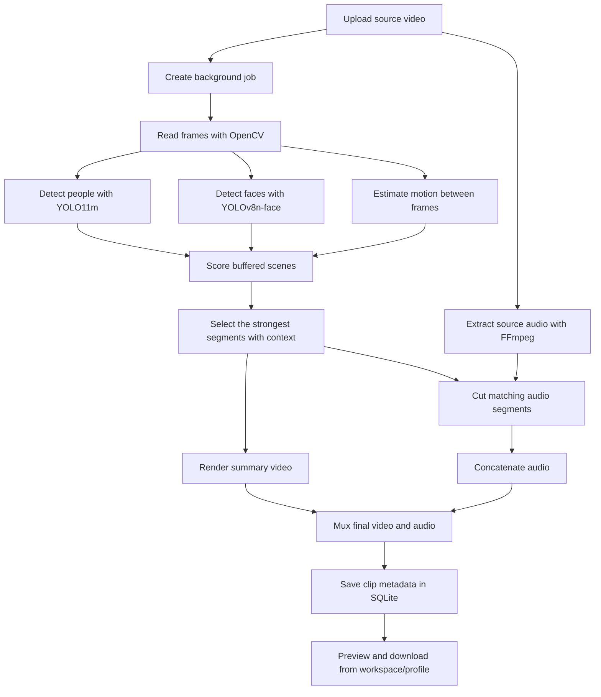

# Sliver — Smart Video Clipping Tool


Sliver is a local AI-powered video summarization app that turns long-form footage into shorter highlight clips. It combines a full-stack web interface for authentication, upload, progress tracking, and downloads with a computer-vision pipeline that analyzes faces, people, motion, and scene context before exporting a stitched recap with synced audio.

## Overview

Sliver is built for cases where manually scanning through long videos is slow and repetitive. The app is designed to help you:

- upload a source video from a browser-based workspace
- choose the target summary duration
- analyze the footage with YOLO-based detection models
- preserve the strongest moments with local context instead of random isolated cuts
- generate a downloadable summary clip with merged audio
- keep a history of exported clips per user

## Demo

### Input Sample

<video src="assets/demo/input.mp4" controls width="100%" poster="assets/screenshots/workspace.png"></video>

Source sample: `assets/demo/input.mp4`  
Resolution: `1920x1080`  
Duration: about `4 min 23 sec`

[Open the input video directly](assets/demo/input.mp4)

### Output Sample

<video src="assets/demo/output.mp4" controls width="100%" poster="assets/screenshots/profile.png"></video>

Generated sample: `assets/demo/output.mp4`  
Resolution: `1920x1080`  
Duration: about `30 sec`

[Open the generated output directly](assets/demo/output.mp4)

If your Markdown viewer does not render embedded video, use the direct links above.

## Interface Tour

| Home | Authentication |
| --- | --- |
|  |  |
| Landing page with the main product pitch and quick entry into the workflow. | Login and sign-up flow for creating a local user account. |

| Workspace | Profile |
| --- | --- |
|  |  |
| Upload a source video, choose the summary length, and watch live progress updates. | Review saved exports, user stats, and previously generated clips. |

## Core Features

- Local web app with home, auth, workspace, and profile pages
- User authentication backed by SQLite and signed session cookies
- Video upload flow with inline preview
- Summary duration input in seconds or minutes
- Requested summaries currently support `1` to `1800` seconds
- Background processing with live progress polling
- Automatic clip generation from long-form video
- Face and person detection using YOLO models
- Scene ranking that blends score, motion, and contextual selection
- FFmpeg-based audio extraction, trimming, concatenation, and muxing
- Downloadable per-user clip history
- Legacy Gradio prototype included for quick experimentation

## How Sliver Works



### Pipeline Breakdown

1. The web app accepts a video upload and creates a background job.
2. The backend stores live job status in memory so the workspace can poll progress.
3. OpenCV reads the input video frame-by-frame.
4. `YOLO11m` is used for person detection and `YOLOv8n-face-lindevs` is used for face detection.
5. Each buffered scene receives a score, while motion is estimated from frame differences.
6. The scene selector boosts stronger moments and preserves surrounding context so the output feels more watchable.
7. The chosen frames are written into a summary video.
8. FFmpeg extracts the original audio, cuts matching segments, concatenates them, and muxes everything into the final `.mp4`.
9. The finished clip is stored locally and recorded in SQLite so it can be reopened later from the profile page.

## Tech Stack

| Layer | Tools |
| --- | --- |
| Frontend | HTML, CSS, JavaScript, Jinja2 templates |
| Backend | Python, `wsgiref.simple_server`, threading, SQLite |
| Computer Vision | OpenCV, Ultralytics, YOLO11m, YOLOv8n-face |
| Media Processing | FFmpeg, OpenCV `VideoWriter` |
| Testing | Python `unittest` |

## Project Structure

```text
.
├── app.py
├── README.md
├── requirements.txt
├── assets/
│   ├── demo/
│   │   ├── input.mp4
│   │   └── output.mp4
│   └── screenshots/
│       ├── home.png
│       ├── profile.png
│       ├── signup.png
│       └── workspace.png
├── static/
│   ├── site.css
│   └── site.js
├── templates/
│   ├── auth.html
│   ├── base.html
│   ├── home.html
│   ├── profile.html
│   └── workspace.html
├── tests/
│   └── test_scene_understanding.py
└── face_clip/
    ├── gradio_ui.py
    ├── run_pipeline.py
    └── pipeline/
        ├── audio_utils.py
        ├── clip_writer.py
        ├── process_video.py
        ├── scene_buffer.py
        ├── scene_scoring.py
        └── scene_understanding.py
```

Runtime data is created automatically under `web_data/` when the app starts:

```text
web_data/
├── uploads/
├── generated/
└── sliver.sqlite3
```

## Installation

### Prerequisites

- Python `3.9+`
- `ffmpeg` available on your system `PATH`
- Local model weights for the pipeline

The current pipeline expects these files inside `face_clip/models/`:

- `face_clip/models/yolo11m.pt`
- `face_clip/models/yolov8n-face-lindevs.pt`

If your clone does not already include them, place the weights there before generating summaries.

### 1. Clone the Repository

```bash
git clone https://github.com/muditagrawal-alt/Sliver-Smart-Video-Clipping-Tool.git
cd Sliver-Smart-Video-Clipping-Tool
```

### 2. Create and Activate a Virtual Environment

macOS / Linux:

```bash
python3 -m venv .venv
source .venv/bin/activate
```

Windows:

```bash
python -m venv .venv
.venv\Scripts\activate
```

### 3. Install Python Dependencies

```bash
pip install -r requirements.txt
```

### 4. Install FFmpeg

macOS:

```bash
brew install ffmpeg
```

Ubuntu / Debian:

```bash
sudo apt update
sudo apt install ffmpeg
```

Windows:

Install FFmpeg manually and add it to your system `PATH`.

## Running the Web App

Start the local server:

```bash
python3 app.py
```

Open the app in your browser:

```text
http://127.0.0.1:8000
```

### Optional Environment Variables

```bash
SLIVER_HOST=127.0.0.1
SLIVER_PORT=8000
SLIVER_SECRET_KEY=your-secret-key
```

Examples:

```bash
SLIVER_PORT=8001 python3 app.py
SLIVER_HOST=0.0.0.0 SLIVER_PORT=8000 python3 app.py
```

## Optional: Run the Legacy Gradio Prototype

The repository also includes an older Gradio interface in `face_clip/gradio_ui.py`.

Install Gradio first if you want to try it:

```bash
pip install gradio
python3 face_clip/gradio_ui.py
```

## Typical User Flow

1. Start the web app.
2. Create an account or log in.
3. Open the workspace.
4. Upload a source video.
5. Choose a summary duration.
6. Submit the job and watch progress update live.
7. Preview and download the finished summary.
8. Revisit the profile page to access saved exports later.

## Runtime Behavior

- Uploaded videos are stored under `web_data/uploads/`
- Generated clips are stored under `web_data/generated/`
- User accounts and clip records are stored in `web_data/sliver.sqlite3`
- Job progress is kept in an in-memory dictionary while the server is running
- Download links are served from `/clips/<clip_id>/download`

## Testing

Current automated tests focus on scene selection behavior:

```bash
python3 -m unittest tests/test_scene_understanding.py
```


## Why This Project Matters

Manual highlight extraction takes time, especially when the input video is long and only a few segments matter. Sliver speeds that up by combining detection, scoring, contextual scene selection, and automated export into a single local workflow that is easier to repeat.

## Good Fit For

- YouTube recap creation
- podcast or interview summarization
- long-form lecture review
- rough-cut highlight extraction before manual editing
- experimenting with local AI-assisted media tooling


## License

The badge above reflects an intended MIT license, but this repository does not currently include a separate `LICENSE` file. Add one before public redistribution or commercial use.
