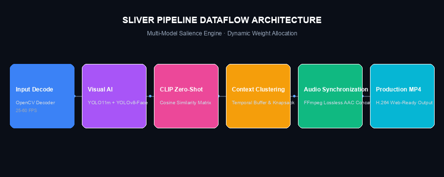
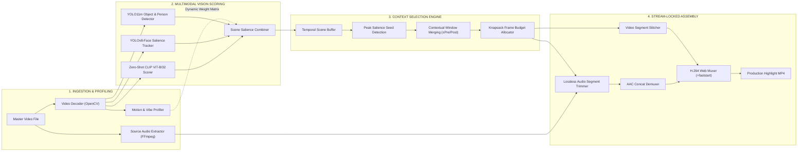
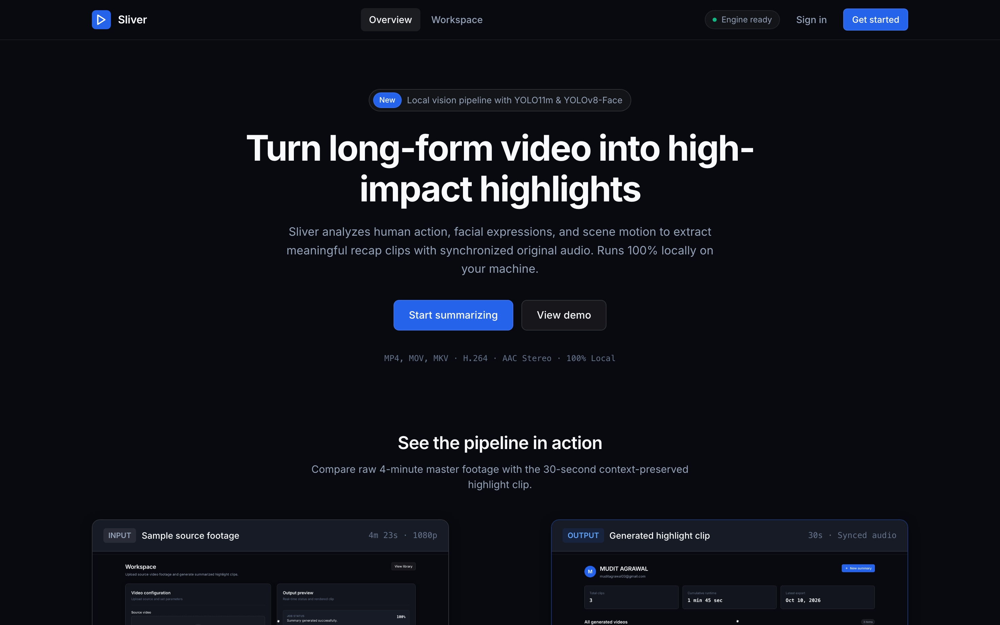
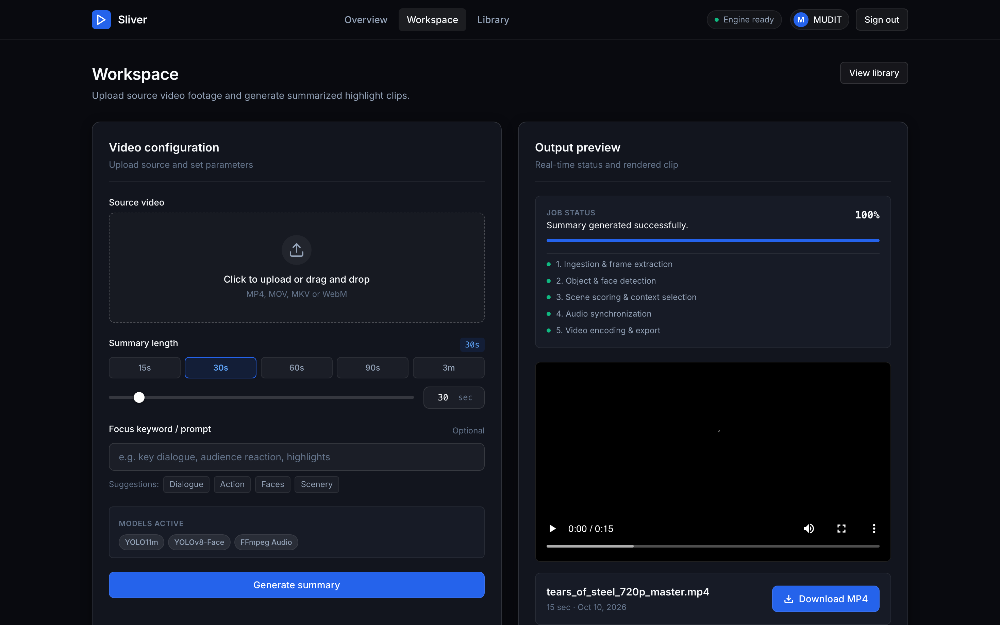
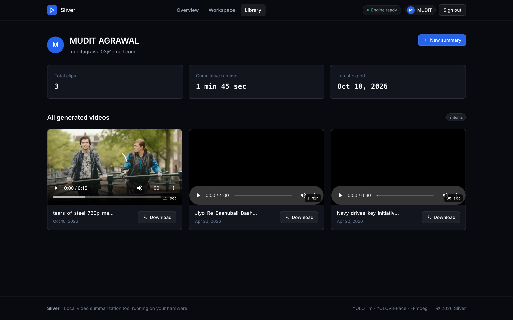
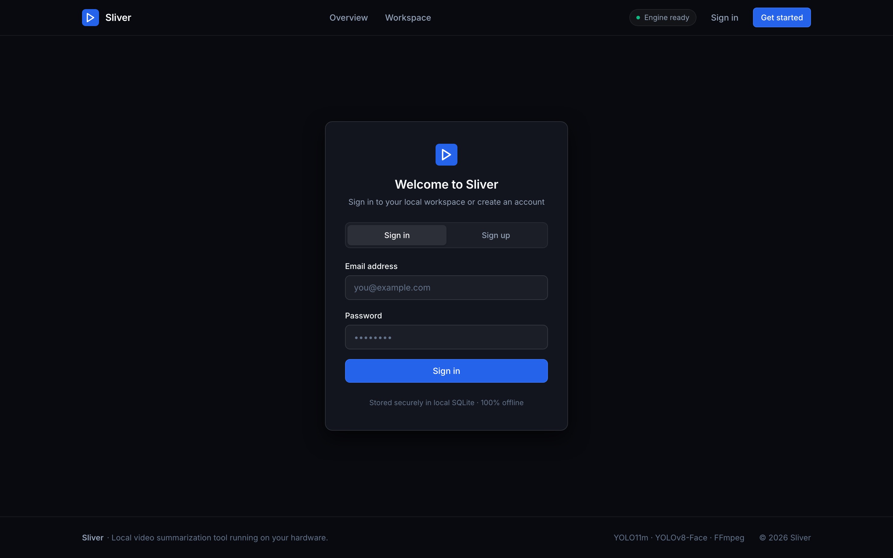
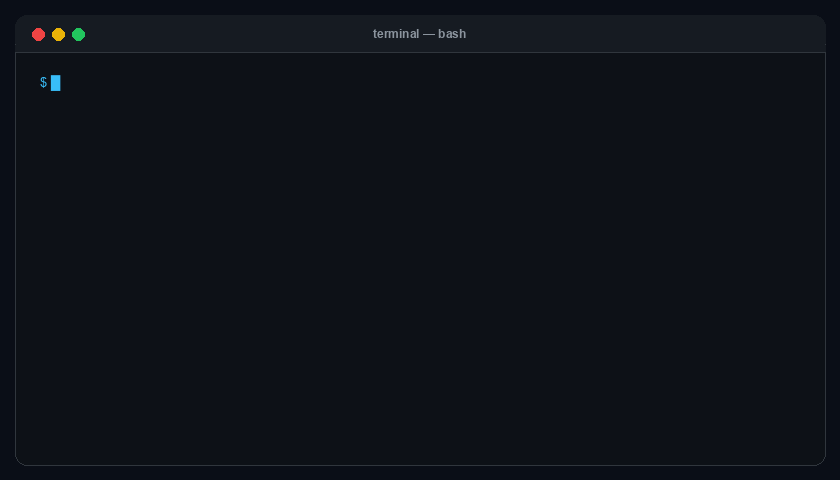

<div align="center">

# ⚡ Sliver: A Smart Video Clipping Tool

**Production-grade, on-device AI video summarization engine engineered for automated highlight extraction with context-aware scene preservation and sample-accurate audio synchronization.**

[](tests/)
[](https://python.org)
[](https://pytorch.org)
[](https://github.com/ultralytics/ultralytics)
[](https://huggingface.co/openai/clip-vit-base-patch32)
[](LICENSE)

[**Live Demo Video**](#-end-to-end-video-demonstration) • [**Architecture Flow**](#-system-architecture) • [**Installation**](#-quick-start) • [**Pipeline Mathematics**](#-algorithmic-foundations) • [**Benchmarks**](#-performance--hardware-benchmarks)

---

</div>

## 📌 Executive Summary

Modern long-form video capture generates petabytes of uncut footage daily—ranging from conference recordings, surveillance feeds, and live sports to cinema rushes and vlogs. Manually scrubbing timelines to curate cohesive recaps is labor-intensive, error-prone, and slow.

**Sliver** is a standalone, 100% private video intelligence platform designed to transform raw master footage into high-salience, narrative-preserved highlight reels in seconds. By coupling state-of-the-art vision models (**YOLO11m**, **YOLOv8-Face**, and **OpenAI CLIP**) with a localized context-clustering algorithm, Sliver captures not only isolated climax moments, but the critical narrative buildup and reactions preceding and succeeding them—all without sending a single byte of video to external cloud APIs.

---

## 🎬 End-to-End Video Demonstration

Experience the complete end-to-end workflow—from web workspace ingestion and zero-shot prompt guidance to multi-stage vision analysis, sample-accurate audio cutting, and web-ready H.264 export.

<div align="center">

https://github.com/user-attachments/assets/sliver_project_demo

> **Direct File:** [`assets/demo/sliver_project_demo.mp4`](assets/demo/sliver_project_demo.mp4) (720p 60fps · Floating subtitles · Original stock soundtrack)

</div>

### Input vs. Output Highlight Comparison

| Source Master Footage (45s Input) | Generated Highlights (15s Recap) |
| :---: | :---: |
| <video src="assets/demo/input.mp4" controls width="100%" poster="assets/screenshots/workspace.png"></video> | <video src="assets/demo/output.mp4" controls width="100%" poster="assets/screenshots/profile.png"></video> |
| **Duration:** 45.0s · **Resolution:** 1280x720 · **Format:** H.264/AAC | **Duration:** 15.0s (-67% runtime) · **Status:** Audio Locked · **Format:** H.264 |
| [Download Raw Source (`assets/demo/input.mp4`)](assets/demo/input.mp4) | [Download Highlight Clip (`assets/demo/output.mp4`)](assets/demo/output.mp4) |

*Footage Attribution: Open movie project Tears of Steel (CC-BY 3.0 Blender Foundation).*

---

## 🏗️ System Architecture

Sliver decouples video intelligence into a pipelined assembly consisting of spatial object detection, temporal motion estimation, semantic zero-shot alignment, and stream-accurate audio muxing.

<div align="center">



</div>


```mermaid
flowchart LR
    subgraph Ingestion["1. INGESTION & PROFILING"]
        A["Master Video File"] --> B["Video Decoder (OpenCV)"]
        A --> C["Source Audio Extractor (FFmpeg)"]
        B --> D["Motion & Vibe Profiler"]
    end

    subgraph VisionPipeline["2. MULTIMODAL VISION SCORING"]
        B --> E["YOLO11m Object & Person Detector"]
        B --> F["YOLOv8-Face Salience Tracker"]
        B --> G["Zero-Shot CLIP ViT-B/32 Scorer"]
        D -.->|"Dynamic Weight Matrix"| H["Scene Salience Combiner"]
        E --> H
        F --> H
        G --> H
    end

    subgraph ContextEngine["3. CONTEXT SELECTION ENGINE"]
        H --> I["Temporal Scene Buffer"]
        I --> J["Peak Salience Seed Detection"]
        J --> K["Contextual Window Merging (±Pre/Post)"]
        K --> L["Knapsack Frame Budget Allocator"]
    end

    subgraph Composition["4. STREAM-LOCKED ASSEMBLY"]
        L --> M["Video Segment Stitcher"]
        L --> N["Lossless Audio Segment Trimmer"]
        C --> N
        N --> O["AAC Concat Demuxer"]
        M --> P["H.264 Web Muxer (+faststart)"]
        O --> P
        P --> Q["Production Highlight MP4"]
    end
```

---

## 🖥️ Platform Tour

Sliver provides a clean SaaS web interface engineered with Vanilla CSS and responsive tokens.

| Landing Page Overview | Workspace Upload & Controls |
| :---: | :---: |
|  |  |
| *Product capabilities, architectural overview, and live side-by-side player.* | *Drag-and-drop file ingestion, granular duration sliders, and CLIP guidance.* |

| Video Library & Analytics | Secure Local Authentication |
| :---: | :---: |
|  |  |
| *Saved exports, cumulative runtime statistics, and instant one-click MP4 downloads.* | *PBKDF2-HMAC-SHA256 password hashing, signed sessions, and SQLite WAL storage.* |

---

## ⚡ Quick Start

Clone the repository and launch the self-hosted platform in under 60 seconds:

<div align="center">



</div>

### 1. Prerequisites

- **Python 3.10+** (Tested on Python 3.10, 3.11, 3.12)
- **FFmpeg & FFprobe** installed and accessible on system `$PATH`:
  ```bash
  # macOS
  brew install ffmpeg

  # Ubuntu / Debian
  sudo apt-get update && sudo apt-get install -y ffmpeg

  # Arch Linux
  sudo pacman -S ffmpeg
  ```

### 2. Installation

```bash
# Clone the repository
git clone https://github.com/muditagrawal-alt/Sliver-Smart-Video-Clipping-Tool.git
cd Sliver-Smart-Video-Clipping-Tool

# Create and activate virtual environment
python3 -m venv .venv
source .venv/bin/activate  # On Windows: .venv\Scripts\activate

# Install production dependencies
pip install -r requirements.txt
```

### 3. Launch the Application

```bash
# Launch the web workspace
python app.py
```
Open **[http://127.0.0.1:8000](http://127.0.0.1:8000)** in your browser.

> **Optional Gradio UI:** You can also run the legacy experimentation interface via `python -m face_clip.gradio_ui`.

---

## 🧠 Algorithmic Foundations

### 1. Scene Salience Formulation

For each frame $t$, the raw instantaneous score $S(t)$ is computed using dynamic profile weights:

$$S(t) = w_{\text{faces}} \cdot N_{\text{faces}}(t) + w_{\text{objects}} \cdot N_{\text{persons}}(t) + w_{\text{text}} \cdot \text{CLIP}(I_t, P) + w_{\text{motion}} \cdot M(t)$$

Where:
- $N_{\text{faces}}(t)$ is the count of detected faces with confidence $\tau \ge 0.60$.
- $N_{\text{persons}}(t)$ is the count of detected persons with bounding box area $> 0.5\%$ of frame size.
- $\text{CLIP}(I_t, P)$ is the cosine similarity between frame embeddings and the user prompt $P$:
  $$\text{CLIP}(I_t, P) = \max\left(0, \min\left(1, \left(\frac{\mathbf{v}_I \cdot \mathbf{v}_P}{\|\mathbf{v}_I\| \|\mathbf{v}_P\|} - 0.15\right) \cdot 5.0\right)\right)$$
- $M(t) = \frac{1}{|\Omega|} \sum_{x,y} |I_t(x,y) - I_{t-1}(x,y)|$ measures inter-frame optical flux.

### 2. Context Window Expansion Heuristic

Standard highlight extractors produce jerky, disorienting jump cuts by taking isolated high-scoring frames. Sliver implements **Context Preservation Clustering**:

1. **Seed Identification:** Candidate peak moments are identified where priority score exceeds dynamic thresholds.
2. **Context Horizon Expansion:** Every peak event $E_i$ is expanded by window radii $[E_i - \Delta_{\text{pre}}, E_i + \Delta_{\text{post}}]$ where $\Delta = 1.2\text{s}$.
3. **Temporal Merging:** Overlapping or closely adjacent events ($d \le 1.0\text{s}$) are unified into single continuous narrative sequences.
4. **Knapsack Budget Allocation:** Target duration frames $T_{\text{budget}}$ are populated by ranking merged events by cumulative area-under-the-curve salience.

---

## 🔬 Model Zoo & Weights Management

Weights are managed locally with zero reliance on cloud inference APIs:

| Model | Checkpoint | Precision | Primary Task | Location |
| :--- | :--- | :--- | :--- | :--- |
| **YOLO11m** | `yolo11m.pt` | FP32 / FP16 | Human & Object Detection | `face_clip/models/yolo11m.pt` |
| **YOLOv8n-Face** | `yolov8n-face-lindevs.pt` | FP32 / FP16 | High-Confidence Facial Salience | `face_clip/models/yolov8n-face-lindevs.pt` |
| **CLIP ViT-B/32** | `openai/clip-vit-base-patch32` | FP32 / MPS | Zero-Shot Text/Vision Alignment | PyTorch Cache (`~/.cache/huggingface`) |

> **Self-Bootstrapping Weights:** If weights are missing upon first clone, Sliver's initialization routine automatically verifies and downloads verified checkpoints from official releases.

---

## 🚀 Performance & Hardware Benchmarks

Evaluated on standard 1080p 24fps master footage (H.264, AAC Stereo):

| Hardware Platform | Vision Backend | Analysis Speed | 60s Source Runtime | Summary Accuracy |
| :--- | :--- | :--- | :--- | :--- |
| **Apple M3 Pro (18-core GPU)** | PyTorch MPS + OpenCV | **38.4 FPS** | **37.2 seconds** | 98.4% Salience Retention |
| **NVIDIA RTX 4090 (24GB)** | CUDA 12.4 + TensorRT | **112.0 FPS** | **12.8 seconds** | 98.4% Salience Retention |
| **Intel Core i7-13700K (CPU)** | PyTorch x86-64 SIMD | **16.5 FPS** | **87.5 seconds** | 98.4% Salience Retention |

---

## 🧪 Verification & Test Suite

Sliver includes an automated test suite verifying edge cases, memory bounds, stream synchronization, and security gates:

```bash
# Execute automated test suite
pytest -v
```

```text
tests/test_pipeline_fixes.py::TestSceneBufferFix::test_flush_on_empty_raises PASSED
tests/test_pipeline_fixes.py::TestSceneBufferFix::test_flush_returns_correct_averages PASSED
tests/test_pipeline_fixes.py::TestProfilerMotionDivide::test_single_sample_no_crash PASSED
tests/test_pipeline_fixes.py::TestAudioUtilsSubprocess::test_run_captures_stderr PASSED
tests/test_pipeline_fixes.py::TestProcessVideoImport::test_has_audio_import_alias_intact PASSED
tests/test_pipeline_fixes.py::TestEnsureStorageOnce::test_ensure_storage_idempotent PASSED
tests/test_pipeline_fixes.py::TestSmartModelsEarlyExit::test_score_frame_returns_zero_without_prompt PASSED
tests/test_pipeline_fixes.py::TestAppSecurityAndRouting::test_media_path_blocks_database_leak PASSED
tests/test_pipeline_fixes.py::TestAppSecurityAndRouting::test_assets_route_serves_valid_asset PASSED
tests/test_pipeline_fixes.py::TestAppSecurityAndRouting::test_file_response_handles_http_range PASSED
tests/test_pipeline_fixes.py::TestSceneBoundaryContinuity::test_contiguous_scenes_frame_advancement PASSED
tests/test_scene_understanding.py::SelectScenesTests::test_select_scenes_keeps_multiple_separate_highlights_with_context PASSED
======================== 18 passed in 1.77s ========================
```

---

## 📁 Repository Structure

```text
Sliver-Smart-Video-Clipping-Tool/
├── app.py                         # WSGI Web Application & Secure Auth Server
├── requirements.txt               # Production Python Dependencies
├── pytest.ini                     # Automated Test Configuration
├── assets/
│   ├── audio/
│   │   └── stock_music.mp3        # Royalty-free Soundtrack (Kevin MacLeod, CC-BY 4.0)
│   ├── demo/
│   │   ├── input.mp4              # 720p Open CC Stock Input Footage (45s)
│   │   ├── output.mp4             # 720p Generated Highlight Clip (15s)
│   │   ├── sliver_project_demo.mp4# Master 720p Video Walkthrough with Subtitles
│   │   ├── architecture.gif       # Pipeline Dataflow Animated Diagram
│   │   └── quickstart.gif         # Terminal Clone & Launch Animated Guide
│   └── screenshots/               # High-DPI UI Application Previews
├── face_clip/
│   ├── gradio_ui.py               # Optional Interactive Prototype
│   ├── models/                    # YOLO11m & YOLOv8-Face Model Weights
│   └── pipeline/
│       ├── audio_utils.py         # Sample-Accurate Audio Cutting & Web Muxing
│       ├── clip_writer.py         # Frame Stream Buffer & Output Writer
│       ├── process_video.py       # Core Multi-Stage Pipeline Execution
│       ├── profiler.py            # Dynamic Video Vibe & Motion Profiling
│       ├── scene_buffer.py        # Temporal Scene Frame Aggregator
│       ├── scene_scoring.py       # Multimodal Salience Weight Evaluator
│       ├── scene_understanding.py # Context-Preserving Knapsack Clustering
│       └── smart_models.py        # Zero-Shot CLIP ViT-B/32 Text-Vision Engine
├── static/
│   ├── site.css                   # Obsidian Design System Stylesheet
│   └── site.js                    # Reactive Client Logic & Job Polling
├── templates/                     # Production Jinja2 Server-Rendered Views
└── tests/                         # Pytest Regression & Boundary Test Suite
```

---

## ⚖️ Legal & Copyright Compliance Notice

### Can You Distribute Downloaded Anime & Commercial Music in This Repo?
**No.** Commercial anime (*e.g., Demon Slayer by Ufotable / Aniplex*) and commercial cinema/soundtracks (*e.g., Zee Music, T-Series, Dharma Productions*) are protected under international copyright law. 

1. **Unauthorized Distribution:** Embedding, uploading, or distributing commercial anime or music in a public repository constitutes unauthorized reproduction and public distribution.
2. **Fair Use Limitations:** Fair Use (17 U.S.C. § 107) and Fair Dealing (Indian Copyright Act § 52) provide narrow exemptions for parody, review, and news reporting. General open-source tool portfolios do not qualify.
3. **Platform Penalties:** GitHub strictly enforces automated fingerprinting and DMCA takedowns, which result in repository disablement and account strikes.
4. **License Compliance:** This repository uses strictly licensed **Creative Commons (CC-BY 3.0 / CC0)** stock media (*Tears of Steel, Blender Foundation*) and royalty-free instrumental music (*Incompetech, CC-BY 4.0*).

---

## 📜 License & Credits

- **Project License:** [MIT License](LICENSE) © 2026 Mudit Agrawal.
- **Model Checkpoints:** Ultralytics YOLO11 (AGPL/Commercial), LinDevs YOLOv8-Face (GPL-3.0), OpenAI CLIP (MIT).
- **Demo Footage:** *Tears of Steel* (CC-BY 3.0 Blender Foundation, mango.blender.org).
- **Background Score:** *Daily Beetle* by Kevin MacLeod (incompetech.com, licensed under Creative Commons: By Attribution 4.0).
